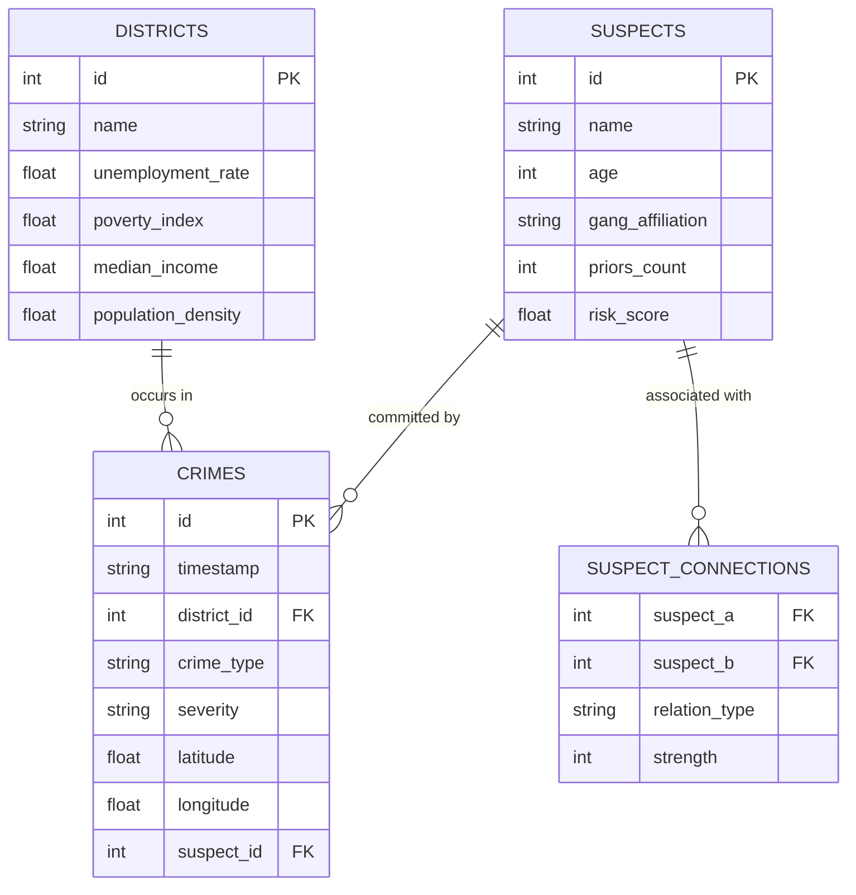

# 🛡️ Pune Crime Intelligence Command Center (PCICC)

<div align="center">


An enterprise-grade, AI-powered Geospatial Analytics, Suspect Risk Profiling, Decision-Support System, and Criminal Social Network Linkage platform built specifically for **Pune, Maharashtra, India**.

[Live Demo Application](https://avibhosale01-crime-project-app-cgmphi.streamlit.app) • [Report Bug](https://github.com/AviBhosale01/Crime-Project/issues) • [Request Feature](https://github.com/AviBhosale01/Crime-Project/issues)

</div>

---

## ⚡ Tech Stack & Technologies

<div align="center">

| Category | Tech Stack Badges |
| :--- | :--- |
| **Core & UI** |   |
| **Machine Learning & AI** |     |
| **Geospatial & Data** |      |
| **Reporting & Exports** |    |

</div>

---

## 🌟 Key Platform Features

*   **📊 Command Dashboard**: Real-time KPI indicators showcasing active crime metrics, DBSCAN-generated hotspots, high-risk recidivists, and daily anomaly spikes (Z-score analysis).
*   **🚓 Tactical Patrol Unit (PCR) Allocation Optimizer**: Proportional risk-weighted decision-support system that optimizes $N$ active patrol vans across Pune sectors to maximize coverage and minimize response times.
*   **🗺️ Geospatial Intelligence Map**: Plotly Mapbox maps centered on Pune showing crime distribution. Includes DBSCAN clustering layers and centroid markers displaying hotspot names and crime counts.
*   **🔍 Intelligence Explorer & Search**: Search directory supporting text-filtering over **2,050 suspects** and **3,000+ crime logs**. Features a detailed **Suspect Dossier Inspector** linking biographical indicators and incident timelines.
*   **🧠 AI Predictive Models**:
    *   *Incident Severity Predictor*: Random Forest Classifier evaluating spatio-temporal and socio-economic variables with out-of-sample confusion matrices and 5-fold cross-validation.
    *   *Recidivism Risk Forecaster*: Random Forest Regressor predicting repeat offender risk scores with $R^2$, MAE, and RMSE evaluation metrics.
    *   *Socio-Economic Correlation*: Interactive Pearson ($r$) and Spearman ($\rho$) correlation matrices tracking crime density vs. poverty and unemployment.
    *   *Dual Anomaly Detector*: Combines 14-day rolling statistical Z-score thresholding with Isolation Forest ML anomaly detection.
*   **🕸️ Criminal Network Link Analysis**: Interactive social network visualization of suspect cliques. Employs NetworkX centrality scores to identify gang hubs (degree centrality) and bridge figures (betweenness centrality).
*   **🤖 AI Officer Briefing Generator**: Auto-generates formal natural language police intelligence briefings for tracked suspects and cases.
*   **📰 Live OSINT Crime News & AI News Analyst**: Fetches live real-time crime news via **NewsAPI**, supporting custom topic searches, quick filter chips, and an interactive AI News Analyst Chatbot.
*   **💬 Universal Text-to-SQL Chatbot**: Conversational interface supporting **Gemini, OpenAI, OpenRouter, Groq, and NVIDIA NIM**. Auto-translates questions into read-only SQLite code, queries the database, and summarizes results contextually.
*   **📝 CRUD Intel Entry (Passkey Locked)**: Form validation interfaces to log crime incidents, register new suspects, and model criminal connections.
*   **📂 View Data Explorer & Editor (Passkey Locked)**: Direct database editor supporting multi-format downloads (Excel `.xlsx`, PDF, CSV, PNG images).

---

## 🔒 Security & Engine-Level Guardrails

> [!IMPORTANT]
> **Read-Only SQLite Engine Security**: The AI Chatbot executes queries using a strict read-only URI connection (`file:{path}?mode=ro`, `uri=True`). Any modification attempts (`DROP`, `DELETE`, `UPDATE`) are rejected directly at the SQLite engine level.

Access to admin forms and raw database tables is protected via security passkey gates:

| Page / Action | Environment / Secret Key | Configuration Method |
| :--- | :--- | :--- |
| **📝 Intel Entry (CRUD)** | `INTEL_ENTRY_KEY` | Set in `.streamlit/secrets.toml` or `config_keys.py` |
| **📂 View Data (Explorer)** | `VIEW_DATA_KEY` | Set in `.streamlit/secrets.toml` or `config_keys.py` |

---

## 📋 Relational Database Schema



---

## 🚀 Quickstart Installation Guide

### Step 1: Clone the Repository
```bash
git clone https://github.com/AviBhosale01/Crime-Project.git
cd Crime-Project
```

### Step 2: Install Dependencies
```bash
pip install -r requirements.txt openpyxl reportlab
```

### Step 3: Run Application Locally
```bash
streamlit run app.py
```
The application will launch automatically in your browser at `http://localhost:8501`.

---

## 👨‍💻 Author & Attribution

<div align="center">

Developed with ❤️ by **Avii**

[](https://github.com/AviBhosale01)

</div>